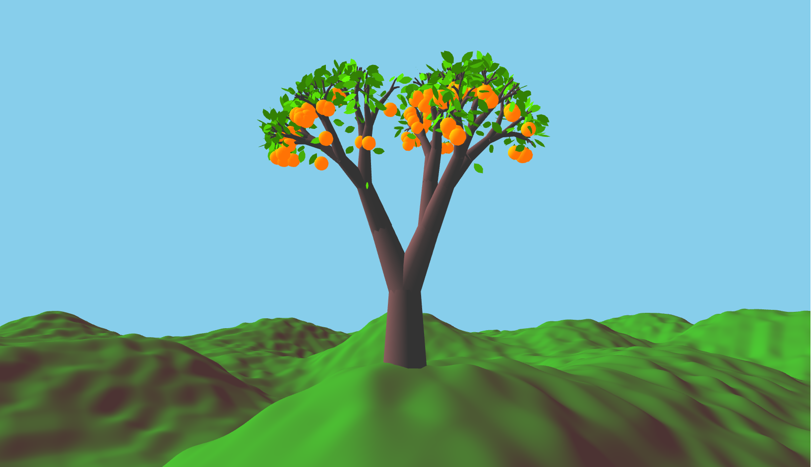

# Real-time Orange Trees
Created by Peter Li and Ian Rackow as a final project for CS1230 Introduction to Computer Graphics.

[Check out the demo video](https://www.youtube.com/watch?v=YxA3U216O9E)!

## Running

Code is compiled and run from the included QT Creator project. The initial render may take a few moments due to the terrain being procedurally generated at runtime.

## L-System Trees

The trees are procedurally generated using L-systems, where the user can specify the branch stochasticity and recursion depth via the Sceneview tab. The user can also control the leaf and fruit density parameters; each branching point has a probability (based on the leaf/fruit density) to bear leaves or fruit. Clicking the "Regenerate tree" button will generate a new tree.

Besides stochastic mesh generation, this project also features stochastic L-systems, where each re-writing rule specifies a distribution of possible output strings for a given input character. This allows the topology of the tree to differ between instances. See our chosen L-system below.

Axiom: "FX"

Re-writing rules:
- "X" becomes ">[-FX]+FX" with 0.8 probability
- "X" becomes ">[-FX]" with 0.2 probability

## Orange Physics

Oranges may be "picked" from the trees via two methods. First, in either Orbit camera or CamTrans camera modes, the "Drop Fruit" button in the Sceneview tab will cause a single fruit to be released from the tree. In CamTrans mode, directly clicking on an orange in the scene will cause it to drop as well. The code traces a ray into the scene through the clicked pixel in order to determine the nearest fruit at that location.

Once released, oranges fall and then roll in the terrain according to 3d inclined plane physics using the local orientations of the terrain. The heights of each point in the terrain are procedurally generated, and then smoothed using bicubic interpolation to create the mesh present in the scene.

